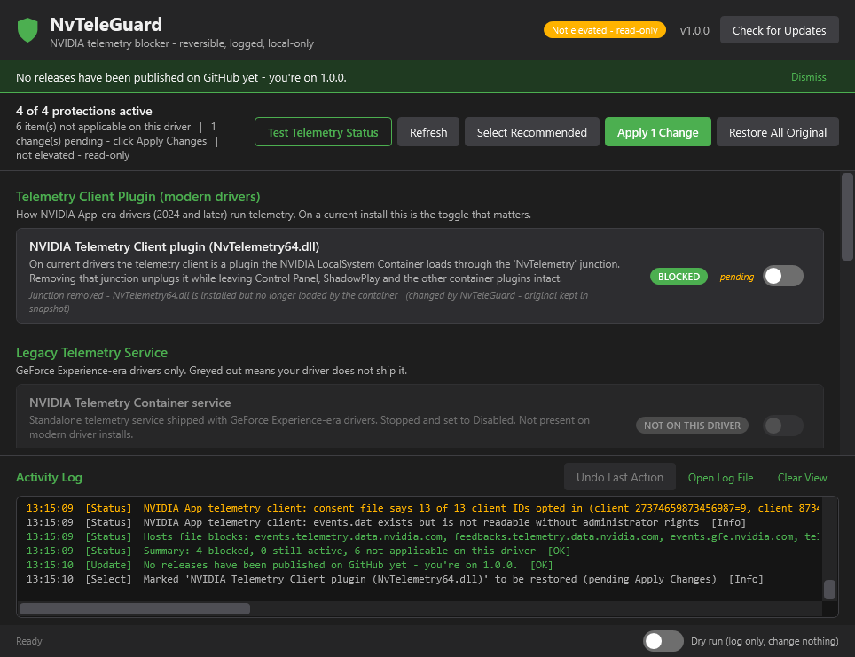

# NvTeleGuard

A small Windows utility that turns NVIDIA driver / NVIDIA App telemetry off — with every change reversible, every action logged, and a status test that shows you what is actually running.



Old telemetry blockers haven't been updated in many years, this is built for the NVIDIA App era: on current drivers the standalone telemetry service, `NvTm*` scheduled tasks and opt-out registry keys that older tools targeted **no longer exist**. The telemetry client is now a plugin that the NVIDIA LocalSystem Container loads through a directory junction — and that junction is what NvTeleGuard removes.

## What it does

| Control | Scope |
|---|---|
| **Telemetry Client plugin** — removes the `NvContainer\plugins\LocalSystem\NvTelemetry` junction so `NvTelemetry64.dll` is no longer loaded (Control Panel, ShadowPlay and the other container plugins are untouched) | Modern drivers (2024+) |
| Stop + disable `NvTelemetryContainer`, disable `NvTm*` scheduled tasks, set `OptInOrOutPreference` / `Global\FTS EnableRID*` opt-out values | GeForce Experience-era drivers (shown greyed out where absent) |
| Disable NVIDIA App SelfUpdate / driver-update-check tasks | Optional — not telemetry, left alone by *Select Recommended* |
| Advanced: disable the whole LocalSystem container, IFEO hard-block, hosts-file block of the confirmed upload endpoints | Opt-in only, with warnings |

**Test Telemetry Status** runs a read-only diagnostic and writes the findings into the log: driver / NVIDIA App / Telemetry Client versions, each control's live state, whether the telemetry DLL is loaded in any process, the consent flags NVIDIA stores in `telemetry_switch.ini`, how many events are queued in `events.dat`, and which endpoints the hosts file blocks.

## How changes are applied

- Flipping a switch only marks the item **pending**. **Apply Changes** shows a confirmation, applies the batch, then every card re-reads *live* system state — a card shows **BLOCKED** only once Windows confirms it.
- The original value of anything NvTeleGuard touches is captured once in `%ProgramData%\NvTeleGuard\snapshot.json`. **Undo Last Action** reverts the last batch; **Restore All Original** puts everything back.
- Every action is appended to `%ProgramData%\NvTeleGuard\actions.log` and shown in the in-app log.
- **Dry run** (status bar) logs what *would* happen without changing anything.
- No network access except the manual **Check for Updates** button (GitHub Releases API).

## Running it

Requirements: Windows 10/11, Windows PowerShell 5.1 (built in). No installation.

1. Download the latest release and extract it (or clone the repo).
2. Double-click `NvTeleGuard.bat` — it launches `NvTeleGuard.ps1` and asks for administrator rights (needed for services, `Program Files` and the registry). Decline the prompt and it runs read-only.

```bat
powershell -NoProfile -ExecutionPolicy Bypass -STA -File NvTeleGuard.ps1 [-DryRun] [-NoElevate]
```

The whole app is plain PowerShell + XAML — open it in any editor and read exactly what it does before you run it.

## Caveats

- NVIDIA driver and NVIDIA App updates recreate the junction and tasks. NvTeleGuard shows the drift (the card goes back to **ACTIVE**) so you can re-apply; it cannot prevent it.
- Display-driver telemetry that lives inside the signed driver package (`DisplayDriverRAS`, `GameSessionTelemetry` under `NVDisplay.ContainerLocalSystem`) is reported by the status test but not controlled — disabling that service breaks the NVIDIA Control Panel.
- The IFEO and hosts-file techniques in the Advanced section can trip antivirus heuristics. They are opt-in and clearly logged.
- This is a community, reverse-engineered tool with no official NVIDIA API behind it. Details are in [PLAN.md](PLAN.md).

## License

MIT — see [LICENSE](LICENSE).
